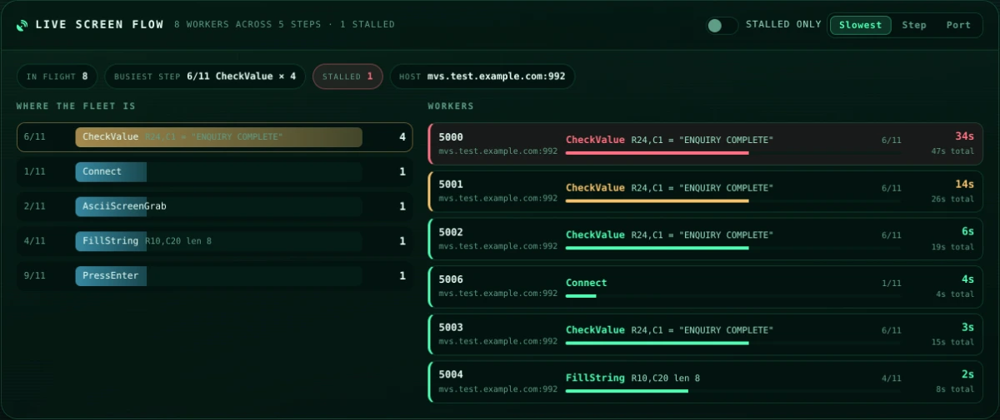

# Web Dashboard

The dashboard is 3270Connect's browser-based operations console. It shows what
your runs are doing right now — live workflow counts, durations, latency
percentiles, host CPU and memory — and lets you launch runs, inspect
configuration, tail logs and terminate processes without leaving the page.

{: .shot }

!!! info "Runs entirely offline"
    Every asset the console needs — styles, scripts, charting library and icons —
    is embedded in the 3270Connect binary and served from `localhost`. Nothing is
    fetched from a CDN, so the dashboard behaves identically on an air-gapped
    build server and on a laptop. Web fonts are the single optional extra; when
    they cannot be reached the console falls back to your local monospace stack.

## Starting the dashboard

=== "Dashboard only"

    ```bash
    3270Connect -dashboard
    ```

    Then open <http://localhost:9200/dashboard>.

=== "Custom port"

    ```bash
    3270Connect -dashboard -dashboardPort 8500
    ```

=== "Alongside a load test"

    ```bash
    3270Connect -config workflow.json -concurrent 25 -runtime 600
    ```

    The dashboard starts automatically whenever `-concurrent` is greater than 1
    or `-runtime` is set, so a load test is observable without extra flags.

Launching 3270Connect with **no command-line arguments at all** — for example by
double-clicking the executable — also forces dashboard mode.

| Flag | Default | Purpose |
|---|---|---|
| `-dashboard` | off | Start the dashboard server. |
| `-dashboardPort` | `9200` | Port for the dashboard HTTP listener. |
| `-dashboardBind` | `localhost` | Interface to listen on. An address, or `all` for every interface. Overrides `DASHBOARD_BIND`. |

The console answers `GET /healthz` with a small JSON document — status,
version, pid and uptime — for a container healthcheck or an uptime probe. It
reads nothing from disk, so a busy load run cannot make the console look
unhealthy. `/` redirects to `/dashboard`.

!!! note "Bound to localhost"
    The listener binds `localhost`, so the console is not on the network
    unless you put it there. To view it from another machine, forward the port
    over SSH: `ssh -L 9200:localhost:9200 user@runner-01`.

    Change it with `-dashboardBind` or the `DASHBOARD_BIND` environment
    variable — and know what you are turning on when you do. The console has no
    sign-in, and *Start Process* launches a load run, against any host it is
    given, for whoever can open the page. On a shared network put an
    authenticating reverse proxy in front of it.

!!! info "In a container"
    The [published image](installation.md#docker) sets `DASHBOARD_BIND=0.0.0.0`
    because it has to: a published port forwards to the container's external
    interface, so a loopback listener inside one refuses every connection from
    the host while the container still reports healthy. What the console is
    exposed to is then decided by the port mapping, which the supplied stacks
    keep on `127.0.0.1`.

    The same setting exists for the REST API as `-api-bind` / `API_BIND`.

## Layout at a glance

The console is a single page in three bands: a **command bar** and **status
bar** pinned to the top, a **metrics area** (KPI tiles, charts and the
[live screen flow](#live-screen-flow)), and the **process table**.

### Command bar

Holds the primary actions — *Start Process*, *Start App*, *Console Logs*,
*Refresh* and the shortcut sheet — alongside a live readout of running
processes, in-flight workflows and console uptime. The search field opens the
[command palette](#command-palette).

### Status bar

Controls how the page stays current, and how it looks.

- **Live** switch — pauses and resumes polling. The ring to its left counts down
  to the next refresh, and pulses when a request is in flight.
- **Interval** — 1 s, 5 s, 10 s, 30 s or 60 s.
- **Theme**, **density** and **effects** toggles — see [Appearance](#appearance).

Polling pauses automatically while any dialog is open, so nothing shifts under
the cursor while you are reading a log or filling in a form, and resumes when
the dialog closes.

## Key metrics

{: .shot }

Six tiles summarise the whole fleet. The counters carry a sparkline built from
the samples this browser session has collected, so you can see the shape of the
last few minutes rather than just the current number.

| Tile | Meaning |
|---|---|
| **Active Workflows** | Workflows in flight across every process. |
| **Total Started** | Workflows launched since the processes started. |
| **Completed** | Workflows that finished without error. |
| **Failed** | Workflows that terminated with an error. The tile turns red as soon as this is non-zero. |
| **Success Rate** | `completed / (completed + failed)`, drawn as a gauge — green at 99 % and above, amber from 90 %, red below. |
| **Throughput** | Workflows completed per minute, derived from the change between polls. |

The chip under each counter shows the change since the previous poll, so a
stalled run is obvious at a glance: started keeps climbing while completed does
not.

## Charts

{: .shot }

**Workflow Duration** plots one series per process, newest run on the right.
Use the legend chips below the chart to isolate a single PID.

**Outcomes** breaks finished work into completed, failed and in-flight, with the
success percentage in the centre.

**System Resources** shows CPU averaged across all 3270Connect processes and
host memory utilisation over time.

**Latency Profile** summarises every recorded duration: p50, p90, p99 and max as
bars, a distribution histogram beneath them, and sample count, mean, min and
standard deviation below that. This is the panel to check when average duration
looks acceptable but users are reporting slow sessions — a healthy mean with a
p99 several times larger points at a tail problem rather than a general one.

### Chart controls

- **Window presets** (`30` / `60` / `120` / `ALL`) limit how many data points the
  duration and resource charts show.
- **Scroll to zoom**, **drag to pan**, and the reset button returns to the full
  range.
- **Export** each chart as a **PNG** image or its underlying series as **CSV**.

## Live screen flow

{: .shot }

Every other panel counts workflows. This one shows the virtual users
themselves: which step of the screen flow each is executing right now, and how
long it has been sitting there. It appears as soon as a run has workers in
flight and disappears when the last one finishes.

The panel answers the question the counters cannot: *what is the run doing at
this second, and is it still moving?*

### Where the fleet is

The left column groups every worker by the step it is on, busiest first. Each
row shows the step's position in the workflow (`6/11`), its type, the screen
position it works on, and how many workers are there.

This is where a stall becomes obvious. Workers spread evenly across steps is a
run making progress; **every worker piled onto one step is a host that is slow
at that particular transaction**, not slow in general — and that tells you
which screen to investigate rather than which server.

**Click a step to isolate it.** The worker list beside it narrows to the
workers standing on that step, and a line above both columns says what is
being hidden and offers to show everything again. Click the same step a second
time to clear it.

### Workers

The right column is one row per virtual user: its script port, the host it is
talking to, the step it is executing with the screen position or expected
value, its progress through the workflow, and two times.

| Figure | Meaning |
|---|---|
| **The large time** | How long this worker has been on its **current step**. |
| **`… total`** | How long its workflow has been running altogether. |

The first is the one that matters. A worker two minutes into its workflow is
ordinary; a worker two minutes into a single `CheckValue` is a host that has
stopped painting screens. Rows are tinted by it — green while moving, amber
past 10 s on one step, red past 30 s — and sorted by it, so whatever is stuck
is at the top without scrolling.

`Connect`, `Disconnect` and `StepDelay` are never coloured as stalls however
long they take: one waits on a TCP session and a host greeting, and a
deliberate delay is a delay.

These clocks tick every second regardless of your refresh interval, so a
stalling worker keeps counting even at 60 s polling.

**Click a worker to see its screens.** The row opens the
[screen captures](#screen-captures) viewer already filtered to that virtual
user and following it, so the answer to "what is on the screen of the worker
that has been on `CheckValue` for forty seconds" is one click away. Rows only
lead somewhere when the run's workflow declares an `OutputFilePath`.

### Controls

- **Search** narrows the worker list by script port, pid, host, step type or
  the step's screen position.
- **Stalled only** filters the list to workers that have been on one step for
  more than 10 seconds.
- **Slowest / Step / Port** sorts the workers. Sorting only re-applies on a
  poll, so a row does not move out from under the pointer while you read it.

The list draws at most 60 rows — worst first, so the cut falls on the healthy
end — and offers to show the rest. The fleet column always counts every
worker, filtered or not.

!!! info "What a step reports, and what it does not"
    A `CheckValue` shows the text it is waiting for, because that is the point
    of the step. A `FillString` shows its position and field length but
    **never the value it types** — workflows fill in usernames, passwords and
    account numbers, and this detail is published to the metrics file that the
    console, the REST API and any [MCP client](mcp.md) can read.

!!! note "Runs started by an older build"
    Time on step is a newer field. A worker from a process that does not
    publish it shows `--` rather than `0s`, which would read as "it just moved
    on".

## Reading the same data from an AI client

The process table and the KPI tiles read the per-process metrics files every
running 3270Connect writes. The [MCP Server](mcp.md) reads the same files, so
an assistant can list runs, report percentiles and stop a run in conversation
— `list_load_tests`, `get_load_test_metrics`, `stop_load_test`. Starting a run
that way is the same primitive the **Start process** button uses.

## Process table

{: .shot }

One row per 3270Connect process, refreshed on every poll.

| Column | Notes |
|---|---|
| **Actions** | Per-process operations — see below. |
| **PID** | Operating-system process ID. |
| **Status** | `Running`, `Ended` or `Killed`, with a pulsing dot while the process is alive. |
| **Progress** | Elapsed against `-runtime`, with the time remaining. Runs without a runtime limit show `unbounded`. |
| **Active / Started / Completed / Failed** | Per-process workflow counters. |
| **Success** | Completed-versus-failed ratio as a split bar; hover for exact figures. |
| **Avg Duration** | Mean workflow duration with a sparkline of the last 24 runs. |
| **Parameters** | The command line the process was started with, with a copy button. |

Every column marked sortable can be clicked to sort ascending or descending.
The toolbar above adds free-text filtering across PID, status and parameters,
status filters (**All**, **Running**, **Ended**, **With failures**), a
table/card layout switch, and **Export** to CSV of whatever is currently
visible.

!!! tip
    Press ++slash++ anywhere on the page to jump straight to the filter field.

### Row actions

| Action | Available when | Opens |
|---|---|---|
| :material-file-code: **Workflow JSON** | The process was started with a config file | The workflow definition, syntax highlighted with line numbers, with copy and download |
| :material-filmstrip: **Screen captures** | The workflow declares `OutputFilePath` | Every screen the run captured, [one at a time](#screen-captures) |
| :material-file-document: **Performance summary** | The run has ended | The `summary_<pid>.txt` report |
| :material-console: **Logs** | Always | The console stream, pre-filtered to that PID |
| :material-skull: **Terminate** | Always | A confirmation dialog, then sends a kill signal |

The dashboard refuses to terminate its own process, so you cannot accidentally
shut down the console you are using.

## Launching a run

{: .shot }

**Start Process** opens a two-column dialog that mirrors the command-line
options.

1. **Drop a workflow JSON** onto the upload zone, or click to browse. The file
   is parsed in the browser before it is uploaded, so host, port, code page,
   output file, step count and ramp-up settings are shown immediately — and a
   malformed file is reported before anything reaches the server. The full
   document is available under *Raw configuration*.
2. **Override** host, port, output file path, ramp-up batch size or ramp-up
   delay for this run only. The uploaded file is not modified. **Test
   connection** dials the host and port and reports the result inline, which is
   worth doing before committing to a long run.
3. **Set the load profile** — concurrent workflows, runtime in seconds, starting
   port, and whether to run headless.
4. Optionally attach an [injection config](injection-config.md) and an
   [RSA token](basic-usage.md#injecting-a-runtime-rsa-token) that replaces
   `{{token}}` placeholders immediately before execution.

**Start App** launches one of the bundled
[sample 3270 applications](basic-usage.md#5-running-a-3270-sample-application-to-help-with-testing-the-workflow-features)
on a port of your choosing, which is the quickest way to exercise a workflow
without a real host.

## Console logs

{: .shot }

The log viewer aggregates `logs/logs_<pid>.json` across every process.

- Filter by **PID**, by **severity** (errors, warnings, success) and by **free
  text**, with matches highlighted in place.
- **Follow tail** keeps the newest line in view; turn it off to scroll back
  without being yanked forward.
- **Wrap** toggles soft wrapping for long lines.
- **Auto refresh** polls the log endpoint on its own interval, independent of
  the page refresh.
- **Copy** the whole stream to the clipboard or **download** it as a `.log`
  file, and **maximise** the dialog for dense output.

Severity is inferred from the message text, so lines mentioning failure,
timeouts or refusals are marked as errors even though the underlying log format
has no explicit level field.

## Screen captures

Every `AsciiScreenGrab` step appends the terminal to the workflow's
`OutputFilePath`. In a concurrent run that is one file holding every screen of
every virtual user, in the order they were captured — which is why the console
does not show it to you as a file. It shows it as a list of screens.

Open it from a process row's **screen captures** action, by clicking a worker
in the [live screen flow](#live-screen-flow), from the command palette, or
with ++v++.

### The strip

The left rail is one entry per screen, newest at the bottom, each showing its
sequence number, the time it was taken, the worker that took it, the step it
came from, and the line of the screen that **changed** — not the application's
title, which is identical on every screen it paints.

Narrow it three ways, in any combination:

- **Search** matches the text of the screens themselves, so `INVALID PASSWORD`
  finds the moment a run started failing.
- **Worker** narrows to one virtual user. Script ports are listed
  most-recently-active first, because a port belongs to one workflow execution
  rather than to a worker for the life of the run.
- **Step** narrows to one step of the workflow — every screen grabbed at step
  6, across all workers, is how you compare the same moment between them.

Consecutive identical screens from the same worker are folded into one entry
with a `×n` badge. A long run keeps its most recent 2,000 screens in the
browser and says how many aged out.

### The screen

The screen is drawn as a screen: 24 rows, 80 columns, a column ruler, row
numbers, and an underline where the host left the cursor.

**Hover for the row and column. Drag across a field for its length.** The
readout below gives 1-based `Row`, `Column` and `Length` — exactly the shape a
workflow step is written in — and the three buttons beside it copy the
selection as a `Coordinates` block, a `FillString` step or a `CheckValue` step,
ready to paste into a workflow. Double-click or press ++esc++ to drop the
selection.

**Changes** tints every character that differs from *that worker's* previous
screen, which is what makes "the host repainted nothing" legible at a glance.

### Following a live run

**Follow** selects each new screen as the run captures it; picking a screen by
hand turns it off so the view stops moving while you read, and pressing ++f++
turns it back on. With a worker filter applied, following follows that worker.

Polling asks only for the bytes of the capture file it has not already read,
so following a run that has written a hundred megabytes of screens costs one
screen's worth of transfer per poll.

++left++ and ++right++ step through screens, ++home++ and ++end++ jump to the
first and last, and the toolbar copies or downloads the current screen. The
download button in the header saves every screen the filter currently shows as
one plain-text file.

## Inspecting a workflow

{: .shot }

The workflow viewer reads the configuration file recorded for a process, pretty
prints it, and highlights keys, strings, numbers and literals with line numbers
down the side. It is the fastest way to confirm which revision of a workflow a
given PID is actually running.

## Command palette

{: .shot }

Press ++ctrl+k++ (++cmd+k++ on macOS) to open the palette. It searches every
action, view setting and per-process operation — including "PID *n* · logs" and
"PID *n* · terminate" for each running process — and matches on subsequences, so
`exp` finds *Export process table*. Navigate with the arrow keys, run with
++enter++, dismiss with ++esc++.

## Keyboard shortcuts

{: .shot }

| Key | Action |
|---|---|
| ++ctrl+k++ | Command palette |
| ++slash++ | Focus the process filter |
| ++r++ | Refresh now |
| ++c++ | Console logs |
| ++v++ | Screen captures |
| ++s++ | Start process |
| ++a++ | Start sample app |
| ++p++ | Pause / resume polling |
| ++d++ | Toggle compact density |
| ++t++ | Cycle theme |
| ++question++ | Show this sheet |
| ++esc++ | Close the active dialog |

Single-key shortcuts are ignored while you are typing in a field or while a
dialog is open.

## Appearance

Four themes ship with the console. Every colour is a CSS custom property, so
charts, gauges and sparklines all re-skin together when you switch.

<div class="shot-grid" markdown>

{: .shot }
**Phosphor** — the default terminal palette.

{: .shot }
**Amber** — warm vintage CRT.

{: .shot }
**Ice** — cool, high contrast.

{: .shot }
**Daylight** — light mode for bright rooms and projectors.

</div>

Two further controls sit beside the theme picker:

- **Density** switches between comfortable and compact rows — compact tightens
  padding and type scale to fit noticeably more processes on screen, which helps
  on large fleets.
- **Effects** turns off the CRT scanlines and the drifting grid backdrop for a
  flatter, quieter surface. The console also honours your operating system's
  *reduce motion* setting automatically.

{: .shot }

Your theme, density, effects, layout, refresh interval and status filter are
remembered in the browser's local storage, so the console comes back the way you
left it.

## Small screens

Below roughly 780 px the process table becomes a card list and the panels stack
into a single column, so the console stays usable from a phone or a narrow
split-screen window. You can also force the card layout at any width from the
layout switch in the panel header.

<div class="shot-grid" markdown>

{: .shot }

{: .shot }

</div>

## Where the data comes from

The console is a thin layer over files that 3270Connect already writes.

| Data | Location |
|---|---|
| Per-process metrics | `<user config dir>/3270Connect/dashboard/metrics_<pid>.json` |
| Console logs | `logs/logs_<pid>.json`, relative to the working directory |
| Performance summaries | `logs/summary_<pid>.txt` |
| Workflow definitions and HTML output | Wherever the workflow's `configFilePath` and `OutputFilePath` point |

The user config directory is `~/.config` on Linux, `~/Library/Application
Support` on macOS and `%AppData%` on Windows. Each process rewrites its own
metrics file every two seconds; stale entries for processes that are long gone
are cleaned up automatically.

### HTTP endpoints

The same endpoints the page uses are available to any HTTP client, which makes
them convenient for scripting or for a health check.

| Endpoint | Method | Returns |
|---|---|---|
| `/dashboard` | `GET` | The console page |
| `/dashboard/data` | `GET` | Metrics as JSON for every running process — or the last snapshot when none are running |
| `/dashboard/workflow?pid=<pid>` | `GET` | The workflow JSON for a process |
| `/dashboard/output?pid=<pid>` | `GET` | The captured screens. `&from=<byte offset>` returns only what was appended after that offset; the response reports `X-Output-From`, `X-Output-Total` and, when the file has been replaced under the reader, `X-Output-Reset` |
| `/dashboard/summary?pid=<pid>` | `GET` | The plain-text performance summary |
| `/console` / `/console?pid=<pid>` | `GET` | Log entries as JSON |
| `/terminal-console?pid=<pid>` | `GET` | The same log lines as plain text |
| `/start-process` | `POST` | Starts a run from a multipart form |
| `/kill?pid=<pid>` | `POST` | Terminates a process |
| `/test-connection` | `POST` | Dials `{"host": …, "port": …}` and reports reachability |
| `/healthz` | `GET` | Liveness, for a container health check or an uptime probe |
| `/whoami` | `GET` | Who is signed in, and whether they may administer |

```bash
# Current totals across every live process
curl -s http://localhost:9200/dashboard/data | jq '.aggregated'

# Tail a specific process from the terminal
curl -s "http://localhost:9200/terminal-console?pid=12345"
```

Where the console has [accounts](authentication.md), the same endpoints take a
bearer token, and `/healthz` stays reachable without one so a probe does not
need a credential:

```bash
curl -s -H "Authorization: Bearer 3270c_…" \
  http://localhost:9200/dashboard/data | jq '.aggregated'
```

## Troubleshooting

??? question "The table is empty"
    The console lists processes that have written a metrics file, and each
    process writes its file every two seconds — so a run shorter than that may
    never appear. Note also that starting the dashboard clears metrics from
    previous runs, so launch it before, or at the same time as, the work you
    want to watch.

??? question "A red banner says contact was lost"
    The page failed to reach `/dashboard/data` twice in a row. It keeps showing
    the last known snapshot and retries on every interval; the banner clears by
    itself once the server responds. If it persists, the 3270Connect process
    hosting the dashboard has exited.

??? question "Counters look frozen"
    Check the **Live** switch in the status bar — polling is paused while any
    dialog is open, and stays off if you switched it off previously, since the
    setting is remembered between visits.

??? question "Charts are missing and everything else works"
    This means the vendored charting script did not load. Reload with a cache
    bypass (++ctrl+shift+r++); the tiles, latency percentiles and table remain
    fully functional in the meantime.

## Sharing the console

The console binds `localhost` and has no sign-in until you ask for one, which
is right for one operator on their own machine and wrong the moment somebody
else needs the page. `AUTH_MODE=local` adds accounts, and with them:

- a sign-in page, per-user passwords and sessions that expire;
- **ownership of a run** — yours is yours to stop, a colleague's is not, and an
  administrator may stop anything;
- an [administration area](administration.md) at `/admin`, with every run on
  the machine and who started it;
- an audit trail of who aimed what at which host.

**→ [Accounts and Sign-In](authentication.md)**

## Related pages

- [Basic Usage](basic-usage.md) — the flags the dashboard's start dialog mirrors
- [Accounts and Sign-In](authentication.md) — putting a sign-in on the console
- [Administration](administration.md) — accounts, groups, tokens, runs and the audit trail
- [Dynamic Field Injection](injection-config.md) — the optional injection config
- [Metrics & Monitoring](metrics.md) — Prometheus metrics for fleet-scale monitoring
- [API Mode](advanced-features.md) — driving 3270Connect over HTTP instead
