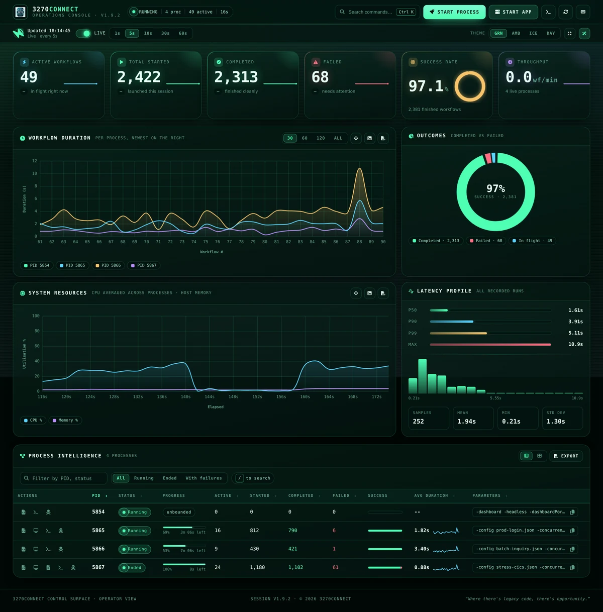

# 3270Connect

{: style="max-width: 200px; height: auto;"}

## Introduction

3270Connect is a robust automation toolkit that pairs a powerful command-line utility with 3270Web, a browser-based web console for enhancing productivity and efficiency in managing and automating interactions with mainframe 3270 applications. It acts as a bridge between modern computing environments and the traditional mainframe terminals, providing a suite of tools that facilitate automated tasks and workflows in a terminal session.

{: .shot }

The <a href="dashboard/">web dashboard</a> — live workflow metrics, latency percentiles,
per-process controls and log streaming, served straight from the binary.

The utility is used by system administrators, developers, and testers who frequently interact with mainframe systems, which are still pivotal in various industries such as banking, insurance, and government services. With 3270Connect, users can script complex sequences of tasks, automate data entry, perform complex online operations, and capture terminal screens for logging or debugging purposes.

One of the main reasons for using 3270Connect is its ability to save time on repetitive tasks by automating them. This can be especially beneficial in testing scenarios where the same set of operations needs to be performed repeatedly. Moreover, the utility provides a way to integrate mainframe operations with modern CI/CD pipelines, thereby modernizing the development and deployment workflows that involve mainframe systems.

With 3270Connect, users can:

- Define and execute automated workflows through a configuration file, enhancing repeatability and reliability in interactions with terminal screens.
- Capture the state of the 3270 terminal screens at any point during a workflow, which is invaluable for documentation and troubleshooting.
- Execute multiple workflows in parallel, optimizing time and resources, especially in complex test environments.
- Operate in a headless mode, allowing the automation to run in the background or in environments without a graphical interface, such as servers or continuous integration systems.
- Utilize a verbose output mode for an in-depth understanding of workflow execution, which assists in monitoring and debugging.
- Surface failure-only logging with `-verboseFailures` to capture concise diagnostics during high-volume runs without enabling full verbose output.
- Run 3270Connect as an API server, enabling advanced automation scenarios and facilitating load and performance testing of mainframe applications.
- Drive a live 3270 session from 3270Web with AI Chat mode, which reads the screen, proposes actions, and can orchestrate chaos exploration with explicit approval.

Through these features, 3270Connect empowers organizations to integrate their legacy systems into modern automated processes, reducing errors, and increasing efficiency.

## Features

Here are the key features of 3270Connect:

- Running workflows defined in a configuration file.
- Command-line interface for scripting and running automation from the terminal.
- Capturing the 3270 screens as the workflow executes.
- Running workflows concurrently with options for controlling the number of concurrent workflows and runtime duration.
- Web dashboard for live metrics, latency percentiles, log streaming and per-process control — self-contained, with no external dependencies at runtime.
- 3270Web to open AI Chat mode for conversational session control.
- Headless mode for running workflows without a graphical user interface.
- Verbose mode for detailed output, plus failure-only logging with `-verboseFailures` for high-concurrency test runs.
- API mode for advanced automation.
- AI Chat mode in 3270Web for screen reading, field entry, key presses, and chaos exploration with per-action approval or Auto Mode.
- Prometheus metrics endpoint (`-promListen`) exposing connect/step timing, workflow outcomes, and live concurrency for fleet-scale monitoring.
- One-shot host compatibility profiler (`-profile`) that produces a `CompatibilityProfile` JSON document shareable with 3270Web for cross-environment comparison.
- Running a 3270 sample application to assist with testing workflow features.

## Getting Started

If you're new to 3270Connect, you can start by exploring the following sections:

- [Installation](installation.md): Learn how to install 3270Connect on your system.
- [Basic Usage](basic-usage.md): Get started with basic usage, running workflows and sample 3270 application(s) to aid testing.
- [Web Dashboard](dashboard.md): Watch runs live, launch them from the browser, and stream logs from the operations console.
- [Workflow Steps](workflow.md): Overview of the various workflow steps available in the 3270Connect application

## Advanced Features

Once you've mastered the basics, you can dive into more advanced features:

- [API Mode](advanced-features.md): Discover how to run 3270Connect as an API server for advanced automation and load performance testing.
- [AI Chat Mode](ai-chat-mode.md): Use 3270Web to drive a live 3270 session through conversation, approve tool calls, and run chaos exploration.
- [Chaos Mode](chaos-mode.md): Learn how toolbar controls and AI Chat share the same exploration state and export workflows.
- [Metrics & Monitoring](metrics.md): Scrape `tn3270_connect_seconds`, `tn3270_step_seconds`, workflow outcomes, and live worker counts from `-promListen`.
- [Host Compatibility Profiler](host-profiler.md): Probe a host once with `-profile` and write a `CompatibilityProfile` JSON document that compares cleanly against 3270Web output.
- [Compatibility Profile Schema](compatibility-profile-schema.md): Field-by-field reference for the shared `CompatibilityProfile` document (v1.0.0).

## Conclusion

The 3270Connect command-line utility is a powerful tool for automating terminal emulator interactions. This documentation is here to help you make the most of it. If you have any questions or need assistance, feel free to reach out to the community or refer to the [GitHub repository](https://github.com/3270io/3270Connect) for more details.

Let's get started with 3270Connect!

## Video example

### 3270Connect Basic Usage

{: style=''}

### 3270Connect API Usage

{: style=''}
