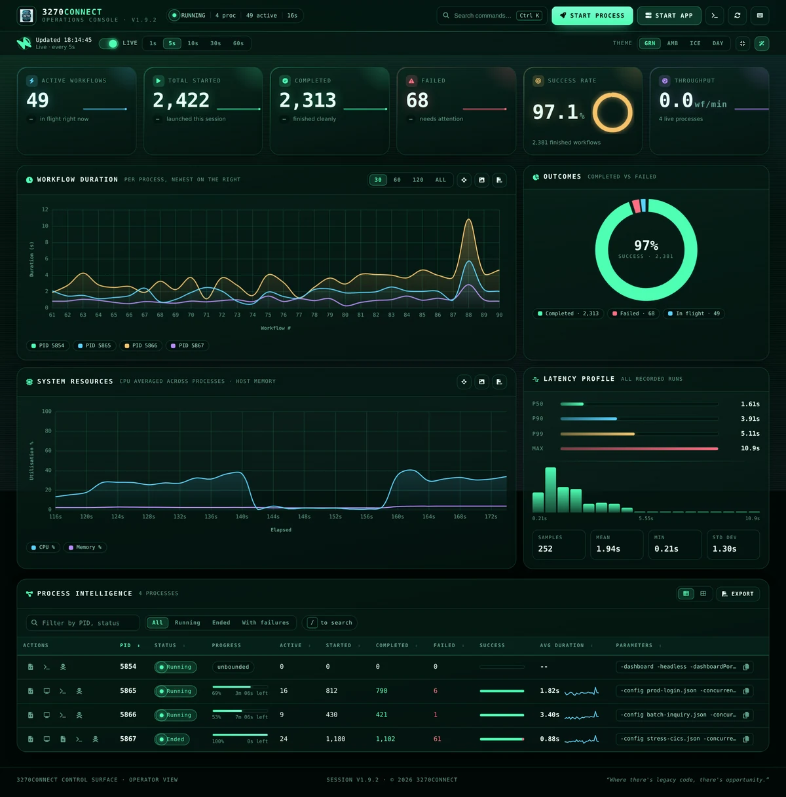

 Open source · v2.0.0

# Replay the mainframe at any scale

Replay repetitive mainframe tasks, check regression workflows in CI, and measure your host under load. Start with a local sample lab — no mainframe needed. Export recordings from 3270Web or write a JSON workflow, then replay it with 3270Connect.

[Try the sample lab](installation.md#the-lab){ .md-button .md-button--primary }
[Install for my host](installation.md){ .md-button }

Free and open source. Runs locally. Docker is required for the sample lab. [Watch the demo](#see-it-work).

  

    
    session · load run
    25 workers
  

  <pre class="term-body">$ 3270Connect -config workflow.json \
    -concurrent 25 -runtime 60 -headless
› connect  mvs.example.com:992    [ok]
› workers  25 spawned               [live]
› steps    FillString · PressEnter  [ok]
› metrics  :9090/metrics scraped    [up]
› </pre>

ReplayJSONWorkflows you can review

AutomationCIExit status reflects the result

Host scaleLoadConfigurable concurrency

EmulatorBundledNo separate emulator install

## See it work

<figure class="demo-video">
  <video controls preload="metadata" playsinline
         poster="/assets/video/console-tour.jpg">
    <source src="/assets/video/console-tour.mp4" type="video/mp4">
    <a href="/assets/video/console-tour.mp4">Download the video</a>.
  </video>
  <figcaption>
    The operations console: launching an eight-worker load run from the browser,
    then watching the process table, the live screen flow and the charts fill in.
  </figcaption>
</figure>

Shorter walk-throughs of one thing at a time:

| Video | Where |
|---|---|
| Your first workflow — describe a session in JSON and replay it | [Basic Usage](basic-usage.md#your-first-workflow) |
| Run it at scale — `-concurrent` and `-runtime` | [Basic Usage](basic-usage.md#running-it-at-scale) |
| Call it over HTTP — one POST returns the screen | [Advanced Features](advanced-features.md#api-mode-in-practice) |
| The operations console, end to end | [Web Dashboard](dashboard.md#a-tour-of-the-console) |
| Sign-in and administration with `AUTH_MODE=local` | [Accounts and Sign-In](authentication.md#what-it-looks-like) |
| Profile a host before you trust a workflow against it | [Host Compatibility Profiler](host-profiler.md#quick-start) |
| Drive it from an AI client over MCP | [MCP Server](mcp.md#check-it-works-first) |

## What it does

-   :material-file-code: **Workflows as JSON**

    ---

    Describe a session once — connect, fill, press, assert, grab the screen, disconnect —
    and run it anywhere. No scripting language to learn, no emulator to install.

    [:octicons-arrow-right-24: Workflow actions](workflow.md)

-   :material-speedometer: **Concurrency & load testing**

    ---

    Run the same workflow across hundreds of parallel workers for a fixed duration, with
    per-workflow timeouts, grace periods and a controlled shutdown.

    [:octicons-arrow-right-24: Basic usage](basic-usage.md)

-   :material-view-dashboard: **Live operations console**

    ---

    Watch runs as they happen: latency percentiles, outcomes, per-process controls and
    streaming logs — served straight from the binary, no external services.

    [:octicons-arrow-right-24: Web dashboard](dashboard.md)

-   :material-account-key: **Accounts when you need them**

    ---

    One operator needs no sign-in and gets none. Share the port and `AUTH_MODE=local`
    adds accounts, groups, per-account API tokens, single sign-on and an audit trail
    of who aimed what at which host.

    [:octicons-arrow-right-24: Accounts and sign-in](authentication.md)

-   :material-chart-line: **Prometheus metrics**

    ---

    Scrape `tn3270_connect_seconds`, `tn3270_step_seconds`, workflow outcomes and live
    worker counts from `-promListen` and put mainframe runs on the same board as everything else.

    [:octicons-arrow-right-24: Metrics & monitoring](metrics.md)

-   :material-robot-excited: **AI Chat mode**

    ---

    Drive a live session from 3270Web by typing plain English. The model reads the screen,
    proposes field fills and key presses, and waits for your approval before acting.

    [:octicons-arrow-right-24: AI Chat mode](ai-chat-mode.md)

-   :material-fingerprint: **Host compatibility profiler**

    ---

    Probe a host once with `-profile` and write a `CompatibilityProfile` JSON document that
    diffs cleanly against 3270Web output across environments.

    [:octicons-arrow-right-24: Host profiler](host-profiler.md)

## The operations console

{: .shot }

The <a href="dashboard/">web dashboard</a> — live workflow metrics, latency percentiles,
per-process controls and log streaming, served straight from the binary.

## Start with one successful replay

1. [Try the Docker lab](installation.md#the-lab) with its bundled host and workflow, or [install the binary](installation.md#linux).
2. Open the console and choose **Try a sample replay**, or follow [the first CLI replay](basic-usage.md#your-first-successful-replay).
3. Check the completed result and screen captures before creating a load test for your own host.

[Try the sample lab](installation.md#the-lab){ .md-button .md-button--primary }

[Platform support and prerequisites](installation.md) · [Source and licence](https://github.com/3270io/3270Connect)
