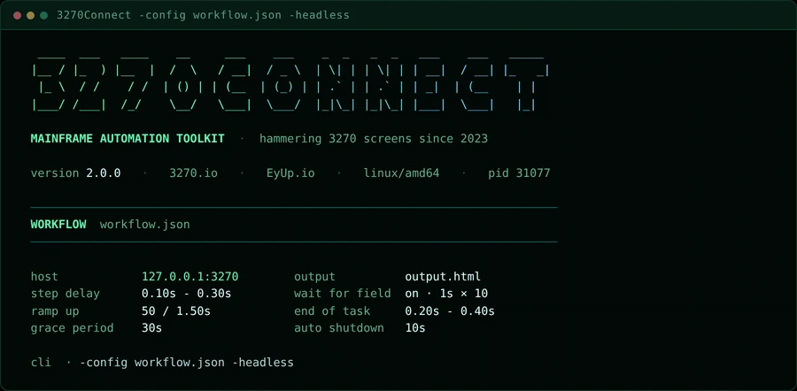
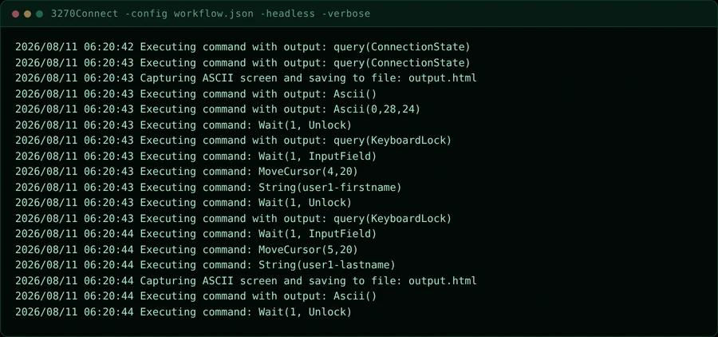
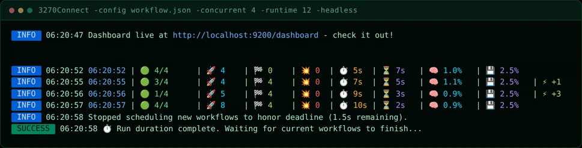
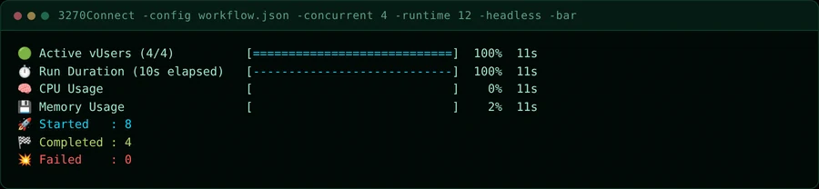
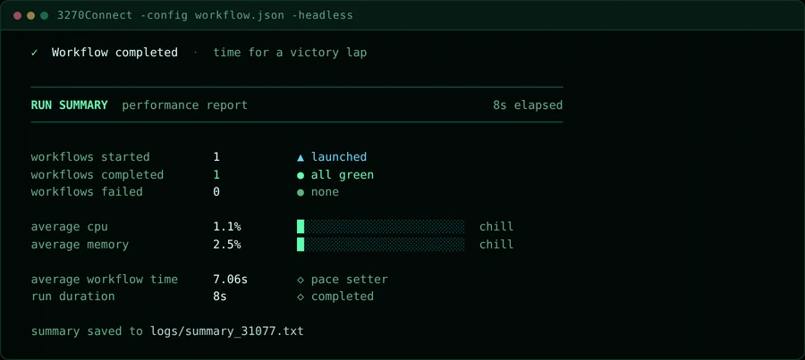
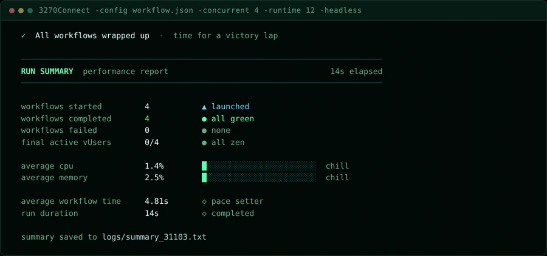

# Terminal UI

Most 3270Connect runs are watched from a terminal rather than a browser. This
page walks through what a run prints, from the header that opens it to the
report that closes it, so you know where to look when something is wrong.

The terminal UI shares its palette with the [web dashboard](dashboard.md) and
with these docs: phosphor green for the accent, muted green for labels, amber
and red reserved for readings that need attention.

## The startup header

Every run opens with the wordmark, a single line of run identity, and the
configuration the run will use.

{: .shot }

The identity line carries the version, the project site, the author, the
platform the binary was built for, and the process id. The pid is the one to
note: it names the summary file written at the end
(`logs/summary_<pid>.txt`), and it is what you pass to `kill` if a run needs
stopping.

Below the rule, `WORKFLOW` names the configuration file and lays out the
settings that shape the run:

| Setting | What it controls |
|---|---|
| `host` | The host and port each workflow connects to |
| `output` | Where `AsciiScreenGrab` steps write, or `(auto temp file)` when unset |
| `step delay` | The random pause inserted between steps |
| `wait for field` | Whether steps wait for the terminal to unlock, with delay and retry count |
| `ramp up` | Batch size and pause used when starting concurrent workers |
| `end of task` | The random pause after a workflow finishes, before its worker starts another |
| `grace period` | How long in-flight workflows get to finish once the runtime deadline passes |
| `auto shutdown` | The countdown on the shutdown prompt when the grace period elapses |

The `cli` line at the bottom repeats the arguments the run was launched with.
It is worth reading twice — most surprising runs are surprising because a flag
was not what you thought it was.

!!! tip "Reading it back later"
    The same settings are written to `logs/summary_<pid>.txt` alongside the
    results, so a run can be reconstructed after the terminal has scrolled away.

## Watching a run

### Single workflow

A single workflow prints nothing between the header and the summary unless you
ask it to. Add `-verbose` to see each emulator command as it is issued:

```bash
3270Connect -config workflow.json -verbose
```

{: .shot }

This is the view to reach for when a step is failing and you need to know
exactly which command the emulator sent and what came back. For failures only,
`-verboseFailures` is quieter — see [Basic Usage](basic-usage.md).

### Concurrent runs

Give the run more than one worker and it switches to a live stats row, printed
every five seconds:

```bash
3270Connect -config workflow.json -concurrent 4 -runtime 12
```

{: .shot }

Each row is one sample: the time, active vUsers against the worker count,
workflows started, completed and failed, elapsed and remaining seconds, and
host CPU and memory. A trailing `⚡ +n` marks workers added by ramp-up in that
interval.

Concurrent runs also start the dashboard automatically, and print its address
in the line above — useful when you want charts rather than rows.

### Progress gauges

`-bar` replaces the stats rows with gauges and hides the INFO lines:

```bash
3270Connect -config workflow.json -concurrent 4 -runtime 12 -bar
```

{: .shot }

The gauges redraw in place, so this stays readable on a long run where the
stats rows would scroll away. Totals for started, completed and failed sit
below them. Use the rows when you want history and the gauges when you want
current state.

!!! info "Running in CI"
    Add `-headless` to keep the emulator from opening a window. It does not
    change what is printed, so the header, the live view and the summary all
    still appear in the build log.

## The end-of-run report

When the run finishes, the summary reports what happened.

{: .shot }

The outcome line at the top is the quick read — a green tick means no workflow
failed. Below the rule:

- **workflows started / completed / failed** — the run's tally. `completed`
  reports the percentage of started workflows when the two differ.
- **average cpu / average memory** — host usage across the run, drawn as a
  meter. The bar is green while the machine is comfortable, warms to amber past
  50%, and turns red past 80%.
- **average workflow time** — mean wall-clock duration of one workflow.
- **run duration** — how long the whole run took.

A concurrent run adds one row, and reports totals across all workers:

{: .shot }

**final active vUsers** shows workers still busy against the worker count when
the run ended. `all zen` means everything drained cleanly; a non-zero count is
drawn in amber and means workflows were still in flight when the grace period
ran out.

The last line names the file the report was written to. That file is plain
text, and it holds the workflow configuration as well as the results:

```bash
cat logs/summary_31077.txt
```

## Width and colour

The header and summary draw at 80 columns — the width of the 3270 screens the
tool drives — and adapt to narrower terminals, dropping the configuration grid
to a single column when it has to.

Colour degrades gracefully. On a terminal without truecolour the palette maps
to the nearest available; with no colour at all the layout still holds, because
it is built from rules and box-drawing characters rather than colour alone.
